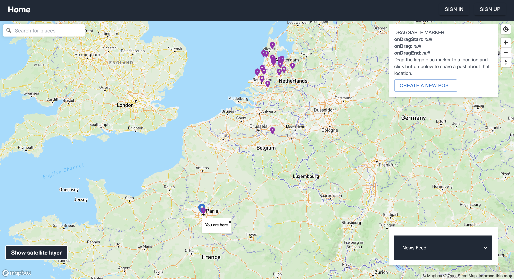

This repository contains the code for the prototype front-end implemented as part of the master's thesis "Design and Evaluation of an Interactive World Map to Share Climate Change Sentiments".



## Getting Started

First, run the development server:

```bash
npm run dev
# or
yarn dev
# or
pnpm dev
```

Open [http://localhost:3000](http://localhost:3000) with your browser to see the result.
